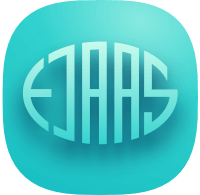

<div id="top" align="center"></div>
<!-- PROJECT LOGO -->
<br />
<div align="center">
  <a href="https://larsejaas.com/">
    
  </a>
</div>

# larsejaas.com 2.0 <!-- omit in toc -->

The second iteration of [larsejaas.com](https://larsejaas.com) built with [Astro](https://astro.build/) and deployed on [Netlify](https://www.netlify.com/)

[](https://www.repostatus.org/#active)

## ⚠️ Before you fork this repo - please read!

I'm dedicated to keeping this project open-source, mainly as a source of inspiration for other developers looking to build their own personal websites. However, I've invested significant time and effort into designing and developing this version of the site, and I'm proud of the outcome.
<br />
<br />
**Please note:**

- Do not claim this work as your own.
- This repository is not intended to be an Astro starter theme.
- If you need assistance with Astro, please refer to their [official documentation](https://docs.astro.build/en/getting-started/).
  <br />

**To summarize:** Feel free to fork this repository for inspiration! Just be sure to create your own unique site and credit me by linking back to [larsejaas.com](https://larsejaas.com) if you use any parts of my code.
<br />
<br />
Thank you for understanding and respecting my work!

<p align="right"><<a href="#top">back to top⬆️</a>></p>

---

## 🔥 Motivation

My journey with this site began in May 2021 when I launched the first version built with [Gatsby](https://www.gatsbyjs.com/). At that time, React was new to me, I had no idea about TypeScript, and coding was a fun hobby.
<br />
<br />
Fast-forward to today, and I've grown significantly as a developer.
Working professionally in the field has allowed me to build numerous exciting projects and expand my knowledge base.
<br />
<br />
While I typically work with React frameworks, I decided to challenge myself by building this site using Astro without React and without any CSS frameworks.

<p align="right"><<a href="#top">back to top⬆️</a>></p>

## 💻 Getting started

Clone the repository to your local development environment:

```bash
git clone https://github.com/LarsEjaas/lars-ejaas-portfolio-v2.git
```

Navigate to the project directory:

```bash
cd lars-ejaas-portfolio-v2
```

Install dependencies:

```bash
npm install
```

Start the development server:

```bash
npm run dev
```

That's it!

The project is intentionally simple, with no JavaScript frameworks, no CSS frameworks, and limited use of TypeScript/JavaScript.

<p align="right"><<a href="#top">back to top⬆️</a>></p>

## 🎯 Project objectives

- Explore Astro, a framework I've heard great things about but never used before.
- Implement and experiment with new CSS features, including:
  - [**CSS container queries**](https://developer.mozilla.org/en-US/docs/Web/CSS/CSS_containment/Container_queries)
  - [**CSS nesting**](https://developer.mozilla.org/en-US/docs/Web/CSS/CSS_nesting)
  - The [**light-dark**](https://developer.mozilla.org/en-US/docs/Web/CSS/color_value/light-dark) CSS color function
  - [**animation-timeline**](https://developer.mozilla.org/en-US/docs/Web/CSS/animation-timeline)
  - [**Cascade layers**](https://developer.mozilla.org/en-US/docs/Learn/CSS/Building_blocks/Cascade_layers)
  - [**View Transitions API**](https://developer.mozilla.org/en-US/docs/Web/API/View_Transitions_API)
  - [**Popover API**](https://developer.mozilla.org/en-US/docs/Web/API/Popover_API)
- Enhance accessibility and gain more experience with screen readers.
- Create a progressively enhanced page that functions fully when JavaScript is disabled or unavailable..
- Maintain the previous design and color scheme while improving areas that needed a face-lift.
- Focus the site on my professional career - but also include a bit about myself and my sports background.

<p align="right"><<a href="#top">back to top⬆️</a>></p>

## 🙏Attribution

I'm grateful to the following developers whose content has inspired me in creating this site:

<div align="center">

|       Thanks to       | Description                                                                                                                                                                                                                                                                                                        |
| :-------------------: | :----------------------------------------------------------------------------------------------------------------------------------------------------------------------------------------------------------------------------------------------------------------------------------------------------------------- |
|    _Jhey Tompkins_    | A major inspiration for diving into the latest CSS features. His [Infinite Marquee](https://codepen.io/jh3y/pen/RwdPvvz) Codepen inspired my refactored overview of development skills using CSS animations. Check out his page at [jhey.dev](https://jhey.dev/)                                                   |
|     _Adam Argyle_     | An excellent resource for guides and updates on new CSS features. His [Responsive app switcher carousel](https://codepen.io/argyleink/pen/MWMQJQy) on CodePen inspired improvements to my existing carousel implementation using scroll-timeline animations. Check out his page at [nerdy.dev](https://nerdy.dev/) |
| _Kirupa Chinnathambi_ | Inspired the animation of floating balloons on my page, combining CSS and JavaScript to replace the previously used GSAP library with a lighter solution. Check out his page at [kirupa.com](https://www.kirupa.com/)                                                                                              |
|                       |

</div>

<p align="right"><<a href="#top">back to top⬆️</a>></p>

## 📬 Contact

If you have any questions or feedback, feel free to write to me using my contact form at: https://larsejaas.com/contact

<p align="right"><<a href="#top">back to top⬆️</a>></p>
